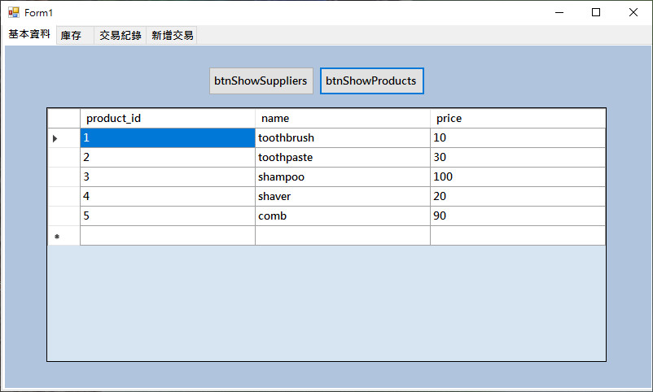
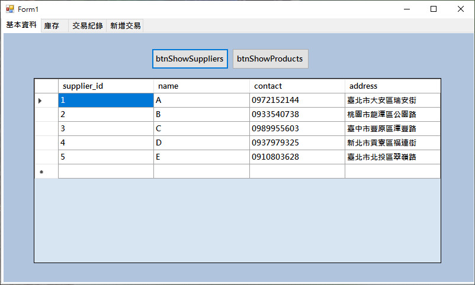
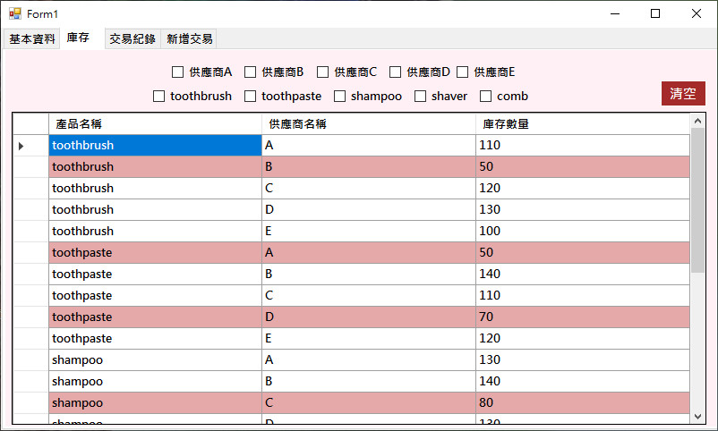
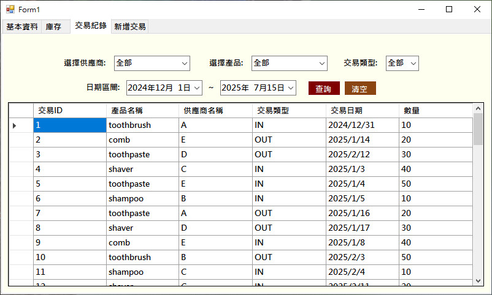
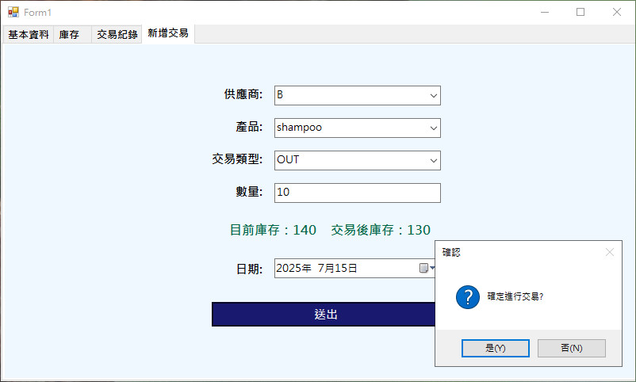
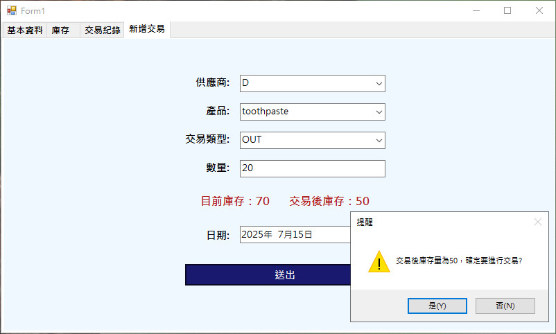
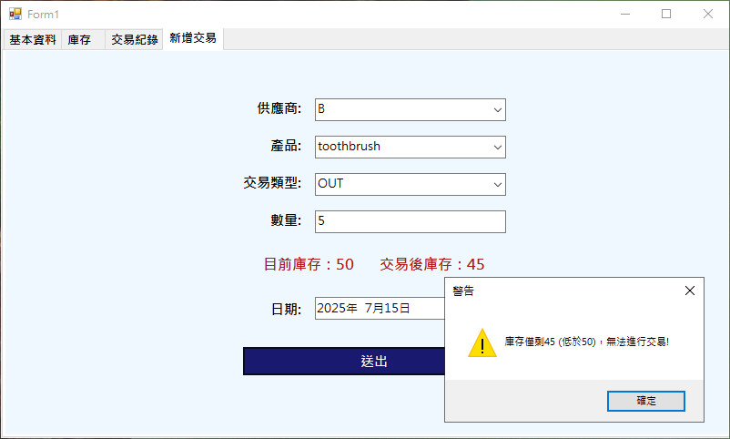

# 簡易進出貨管理系統(Windows 應用程式版)
本專案為一套以 C# 搭配 WinForm 框架開發的 Windows 桌面應用程式，目標是提供小型企 業或商家一個直覺易用的進銷存管理工具。系統支援商品進貨、出貨、庫存查詢與歷史交易紀錄管理，並可即時與 MySQL 資料庫串接，確保資料同步與查詢效能。系統界面設計注重 使用者體驗，透過圖形化操作流程，提升日常庫存管理效率與準確性。
### 技術架構:
+ 前端框架:WinForm(Windows Forms)
+ 後端語言:C#
+ 資料庫系統:MySQL
+ 功能特點:即時資料寫入、條件篩選、視覺化警示(低庫存高亮顯示)

## 系統功能模組說明
1. 產品與供應商資料顯示
+ 提供「顯示產品」與「顯示供應商」按鈕，點選後即時從 MySQL 資料庫讀取資料並顯示至 DataGridView。
+ 表格資料動態更新，支援多欄位排序與檢視。

   
2. 各產品庫存查詢(交易前)
+ 顯示每個供應商下各產品的現有庫存量。
+ 提供篩選功能(Checkbox 可多選供應商與產品類別)。
+ 若某項產品的庫存低於 50，自動以紅色背景顯示，提醒使用者注意補貨。
 

3. 交易紀錄瀏覽
+ 顯示所有歷史交易紀錄，支援以下篩選條件:
+ 供應商
+ 產品名稱
+ 交易類型(入庫 / 出貨)
+ 日期區間(起始與結束日)
+ 可使用「清空搜尋」功能快速重置所有篩選條件。

 
1. 新增交易模組
+ 使用者可於此頁面新增一筆交易資料(入庫或出貨)。資料會即時寫入 MySQL 資料庫。系統在提交交易前會根據「交易後庫存」自動進行交易合理性檢查，邏輯如下:

- ✅ 若交易後庫存數量 ≥ 80:允許交易，庫存顯示正常

- ✅ 若 50 ≤ 交易後庫存 < 80:允許交易，但系統會標記該產品庫存為「低量」並以紅色顯 示。

- ✅ 若交易後庫存 < 50:禁止交易，顯示錯誤提示，並要求使用者調整交易數量。

  
 本系統整合視覺化操作介面與資料即時同步機制，不僅讓使用者能夠快速掌握每日商品進出狀況，也降低手動管理庫存所產生的錯誤風險。透過與 MySQL 資料庫的串接，確保資料一致性與擴充彈性。此專案展現我在 Windows 桌面應用程式開發、資料邏輯處理與資料庫整合方面的實作能力，作為實務應用導向系統的基礎範例。
